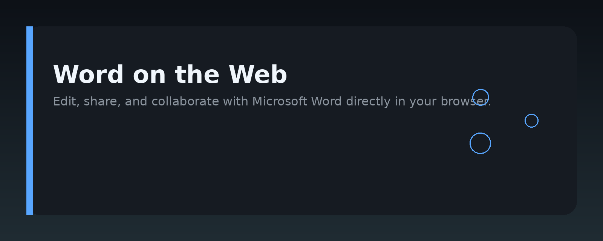
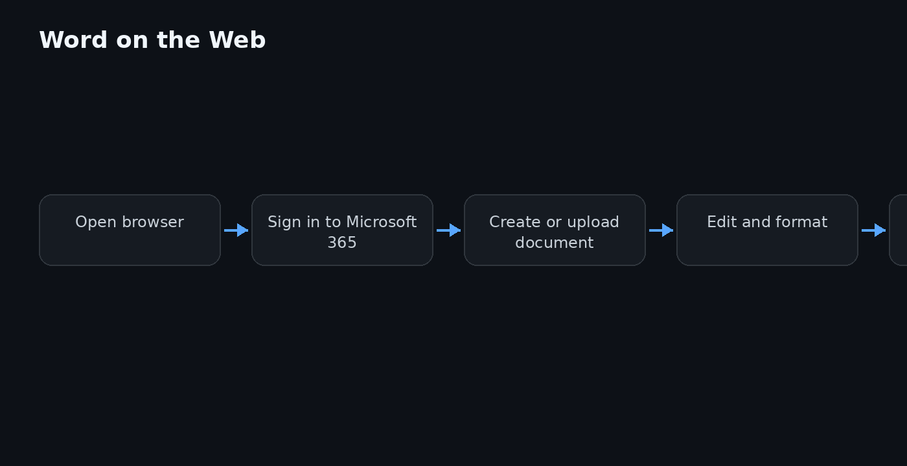

# Microsoft Word on the Web: A Practical Guide




## Overview

This repository is a practical, hands-on guide to using **Microsoft Word on the web** — the browser-based version of Word that runs without a local install. It covers the core features of the **Word web app**, how it differs from the desktop client, and how to integrate it into document workflows, team collaboration, and automated document processing.

The focus is on real usage: what works, what doesn't, and how to get the most out of the **online Word** experience. You will find configuration notes, workflow patterns, and runnable examples for automating tasks around the web version of Word.

## Why it exists

The **Microsoft Word website** (office.com) offers a free, browser-based entry point to Word. Many teams and individuals rely on it for quick edits, shared documents, and cross-device access — yet most documentation targets the desktop application. This repo fills that gap by documenting the web-specific behavior, limitations, and integration paths.

It exists to answer practical questions like:

- What can I do in **Word online** that I cannot do in the desktop app?
- How do I share a document and collaborate in real time?
- How do I automate document creation when users work in the browser?
- What happens to formatting when a file moves between web and desktop?

## Core concepts

- **Word for the web** — the browser-hosted editor, accessed via office.com or a SharePoint/OneDrive link.
- **AutoSave** — always-on saving to OneDrive or SharePoint; no manual save button in most cases.
- **Co-authoring** — multiple users editing the same document simultaneously, with presence indicators and version history.
- **Feature parity gaps** — some desktop features (e.g., mail merge, advanced macros) are missing or limited in the web client.
- **File format** — primarily `.docx`; older `.doc` files are opened but may require conversion.
- **Storage backend** — documents live in OneDrive, SharePoint, or Teams; the web app is a frontend to those stores.

## Architecture

The web version of Word is a client-side application that talks to Microsoft's cloud services. A simplified view:


- **Browser client** — renders the document, handles editing, and sends incremental changes.
- **OneDrive/SharePoint** — the storage and sync layer; holds the actual `.docx` files.
- **Microsoft Graph API** — the programmatic interface for reading, writing, and managing documents outside the UI.
- **Office Online Server** — the backend that handles conversion, rendering, and co-authoring coordination (managed by Microsoft, not by you).

For automation, you interact with the **Graph API** rather than the web UI. The web app itself is not scriptable directly.

## Practical workflow

A typical workflow for a team using **Word on the web**:

1. **Create** — Start a new document at office.com or from a SharePoint library.
2. **Share** — Use the Share button to send a link with edit or view permissions.
3. **Collaborate** — Edit together in real time; use comments and @mentions for feedback.
4. **Version control** — Rely on AutoSave and the Version History pane to track changes.
5. **Export** — Download as `.docx`, `.pdf`, or other formats when needed.
6. **Automate** — For repetitive tasks, use the Graph API or Power Automate instead of manual steps.

## Examples

The following examples show how to work with **Word documents on the web** programmatically. They assume you have a Microsoft Graph access token with `Files.ReadWrite` permission.

### List recent Word documents from OneDrive

```python
import requests

token = "YOUR_ACCESS_TOKEN"
headers = {"Authorization": f"Bearer {token}"}

response = requests.get(
    "https://graph.microsoft.com/v1.0/me/drive/root/search(q='.docx')",
    headers=headers,
)

for item in response.json().get("value", []):
    print(item["name"], item["webUrl"])
```

### Create a new Word document via Graph API

```javascript
const token = "YOUR_ACCESS_TOKEN";
const headers = {
  "Authorization": `Bearer ${token}`,
  "Content-Type": "application/json",
};

// Create an empty .docx file in the root of OneDrive
const createRes = await fetch(
  "https://graph.microsoft.com/v1.0/me/drive/root/children",
  {
    method: "POST",
    headers,
    body: JSON.stringify({
      name: "NewDoc.docx",
      file: {},
      "@microsoft.graph.conflictBehavior": "rename",
    }),
  }
);

const file = await createRes.json();
console.log("Created:", file.webUrl);
```

### Download a document as PDF

```bash
# Using curl with a Graph API token
curl -L -H "Authorization: Bearer YOUR_ACCESS_TOKEN" \
  "https://graph.microsoft.com/v1.0/me/drive/items/{ITEM_ID}/content?format=pdf" \
  --output document.pdf
```

### Check if a user has edit permission on a shared document

```python
import requests

token = "YOUR_ACCESS_TOKEN"
item_id = "ITEM_ID"  # from Graph API
headers = {"Authorization": f"Bearer {token}"}

response = requests.get(
    f"https://graph.microsoft.com/v1.0/me/drive/items/{item_id}/permissions",
    headers=headers,
)

for perm in response.json().get("value", []):
    for link in perm.get("link", {}).values():
        print("Permission:", link.get("scope"), link.get("type"))
```

## FAQ

**Is Microsoft Word on the web free?**
Yes, a basic version is free with a Microsoft account at office.com. Advanced features and storage may require a Microsoft 365 subscription.

**Can I use macros in the web version?**
No. VBA macros are not supported in Word for the web. Use the desktop app for macro-heavy work.

**Does formatting always survive the round trip?**
Mostly, but complex layouts, embedded objects, and some advanced styles can shift. Test critical documents before relying on the web version for final output.

**How do I edit a document offline?**
The web app requires a connection. Use the desktop app or the mobile app's offline mode instead.

**Can I automate the web UI itself?**
No, the browser UI is not scriptable. Use the Graph API or Power Automate for automation.

**Where are my documents stored?**
In OneDrive, SharePoint, or Teams, depending on where you created them. The web app does not store files locally.

## License MIT

MIT License

Copyright (c) 2025 word-web-docs-guide contributors

Permission is hereby granted, free of charge, to any person obtaining a copy
of this software and associated documentation files (the "Software"), to deal
in the Software without restriction, including without limitation the rights
to use, copy, modify, merge, publish, distribute, sublicense, and/or sell
copies of the Software, and to permit persons to whom the Software is
furnished to do so, subject to the following conditions:

The above copyright notice and this permission notice shall be included in all
copies or substantial portions of the Software.

THE SOFTWARE IS PROVIDED "AS IS", WITHOUT WARRANTY OF ANY KIND, EXPRESS OR
IMPLIED, INCLUDING BUT NOT LIMITED TO THE WARRANTIES OF MERCHANTABILITY,
FITNESS FOR A PARTICULAR PURPOSE AND NONINFRINGEMENT. IN NO EVENT SHALL THE
AUTHORS OR COPYRIGHT HOLDERS BE LIABLE FOR ANY CLAIM, DAMAGES OR OTHER
LIABILITY, WHETHER IN AN ACTION OF CONTRACT, TORT OR OTHERWISE, ARISING FROM,
OUT OF OR IN CONNECTION WITH THE SOFTWARE OR THE USE OR OTHER DEALINGS IN THE
SOFTWARE.